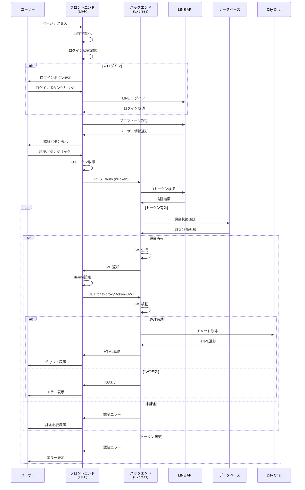
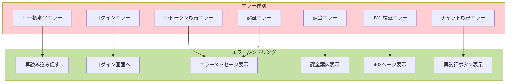
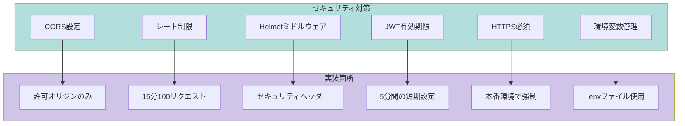

# システムフローチャート

## 全体フロー図

```mermaid
flowchart TB
    Start([ユーザーがLIFFページにアクセス]) --> InitLIFF[LIFF SDK初期化]
    
    InitLIFF --> CheckLogin{ログイン状態確認}
    
    CheckLogin -->|未ログイン| ShowLoginBtn[ログインボタン表示]
    CheckLogin -->|ログイン済み| GetProfile[プロフィール取得]
    
    ShowLoginBtn --> ClickLogin[ログインボタンクリック]
    ClickLogin --> LineLogin[LINE ログイン画面へ]
    LineLogin --> LoginSuccess[ログイン成功]
    LoginSuccess --> GetProfile
    
    GetProfile --> ShowAuthBtn[認証ボタン表示]
    ShowAuthBtn --> ClickAuth[認証ボタンクリック]
    
    ClickAuth --> GetIDToken[LIFF.getIDToken()実行]
    GetIDToken --> SendToBackend[IDトークンを/authへPOST]
    
    SendToBackend --> VerifyToken{IDトークン検証}
    VerifyToken -->|無効| AuthError[認証エラー返却]
    VerifyToken -->|有効| CheckPayment{課金状態確認}
    
    CheckPayment -->|未課金| PaymentError[課金エラー返却]
    CheckPayment -->|課金済み| GenerateJWT[JWT生成]
    
    GenerateJWT --> ReturnJWT[JWTをフロントエンドへ返却]
    ReturnJWT --> ShowChat[チャット表示用iframe設定]
    
    ShowChat --> RequestProxy[/chat-proxy?token=JWT へアクセス]
    RequestProxy --> VerifyJWT{JWT検証}
    
    VerifyJWT -->|無効| ProxyError[403エラーページ返却]
    VerifyJWT -->|有効| FetchDify[Difyチャット取得]
    
    FetchDify --> ReturnHTML[HTMLをそのまま返却]
    ReturnHTML --> DisplayChat[iframeにチャット表示]
    
    AuthError --> ShowError[エラーメッセージ表示]
    PaymentError --> ShowPaymentMsg[課金必要メッセージ表示]
    ProxyError --> ShowProxyError[エラーページ表示]
    
    style Start fill:#e1f5fe
    style DisplayChat fill:#c8e6c9
    style AuthError fill:#ffcdd2
    style PaymentError fill:#ffcdd2
    style ProxyError fill:#ffcdd2
```

## 認証フロー詳細



## データフロー図

```mermaid
flowchart LR
    subgraph Frontend[フロントエンド]
        HTML[index.html]
        JS[JavaScript]
        LIFF[LIFF SDK]
    end
    
    subgraph Backend[バックエンド]
        Express[Express Server]
        Auth[/auth エンドポイント]
        Proxy[/chat-proxy エンドポイント]
        JWT[JWT処理]
    end
    
    subgraph External[外部サービス]
        LINE[LINE API]
        DB[(データベース)]
        Dify[Dify Chat]
    end
    
    JS --> LIFF
    LIFF --> LINE
    JS --> Auth
    Auth --> JWT
    Auth --> LINE
    Auth --> DB
    JS --> Proxy
    Proxy --> JWT
    Proxy --> Dify
    
    style Frontend fill:#e3f2fd
    style Backend fill:#f3e5f5
    style External fill:#fff3e0
```

## エラーハンドリングフロー



## セキュリティフロー

